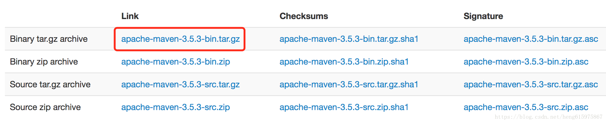
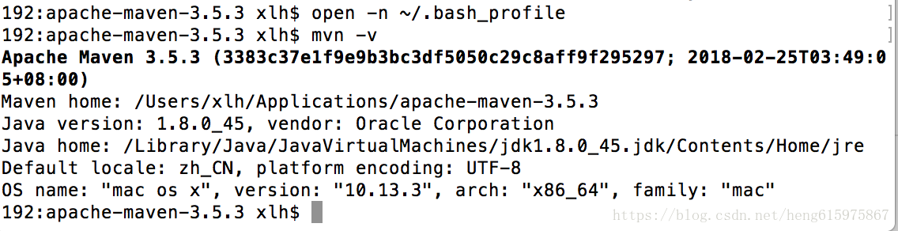

# Maven-配置本地仓库

# Maven-配置本地仓库

### 一.Mac配置本地仓库

1. **下载安装包**
   
    从官网（[*https://maven.apache.org/download.cgi*](https://maven.apache.org/download.cgi)）下载 Maven 并解压。
    
    
    
    Untitled
    
2. **配置 Maven 环境变量。**

① 打开终端 ，输入 `open -n ~/.bash_profile`。
②然后输入 Maven 的环境变量：

```
#maven
export M2_HOME=/Users/xlh/Applications/apache-maven-3.5.3
export PATH=$M2_HOME/bin:$PATH
```

③ 编辑完后，保存并退出。

④ 输入 `source ~/.bash_profile` 使环境变量生效。

⑤ 输入 `mvn -v` 查看 Maven 否安装成功。



Untitled

### **二、Android studio中使用Maven发布本地仓库**

**基本描述：**

**maven的仓库分两类：**

**1、本地仓库**

maven在本地存储构件的地方。

maven本地仓库的默认位置：在用户的目录下 `.m2/repository/` 的仓库目录。

**2、远程仓库**

两个 Maven 中央库：mavenCentral 和 jcenter。

部署在内网服务器的私有仓库。

**Maven在本地仓库中的对应存储路径：**

- **groupId** 唯一标识符：`com.android.dzrefresh` 对应路径：`com/android/dzrefresh`
- **artifactId** 类似于项目名称：App 对应路径：`com/android/dzrefresh/App`
- **version** 版本号：1.0.0 对应路径：`com/android/dzrefresh/App/1.0.0`
对应得也就是：
`compile ‘com.android.dzrefresh:App:1.0.0’`

**指定本地仓库路径：**

**自定义本地路径：**

```groovy
repositories {        maven { url '/Users/xlh/.m2/repository' }}
```

**默认本地路径：**

```groovy
repositories {        mavenLocal()}
```

### 三、**发布本地库流程如下：**

1. **新建一个Android项目**
   
    在项目下创建一个Libary（如果直接在Android项目下发布到本地仓库会生成apk包，而lib下生成的是aar包可以作为依赖使用）。
    
2. **配置参数**
   
    在Library也就是刚才创建的AndroidLib下的gradle.build中添加
    
    ```groovy
    apply plugin: 'maven'uploadArchives{    repositories.mavenDeployer{        // 本地仓库路径        repository(url:"file:///users/xlh/.m2/repository/")        // 唯一标识        pom.groupId = "com.android.dzrefresh"        // 项目名称        pom.artifactId = "App"        // 版本号        pom.version = "1.0.0"    }}
    ```
    
    也可以通过maven-publish方式发布
    
    ```groovy
    apply plugin: 'maven-publish'publishing {    publications {        maven(MavenPublication) {            artifact "/Users/xlh/DZRefresh/xxlib/build/outputs/aar/xxlib-debug.aar"            groupId "com.android.dzrefresh"            artifactId "APP"            version "1.0.0"        }    }}
    ```
    
3. **发布到本地仓库**
   
    maven方式命令
    
    ```bash
    gradlew uploadArchives
    ```
    
    maven-publish方式
    
    ```bash
    gradlew publishToMavenLocal
    ```
    
4. **使用本地库**
    1. 在Android项目下的build.gradle文件中配置路径
       
        ```groovy
        repositories {      jcenter()      mavenLocal()}
        ```
        
    2. 引用
       
        ```groovy
        compile 'com.android.dzrefresh:App:1.0.0'
        ```